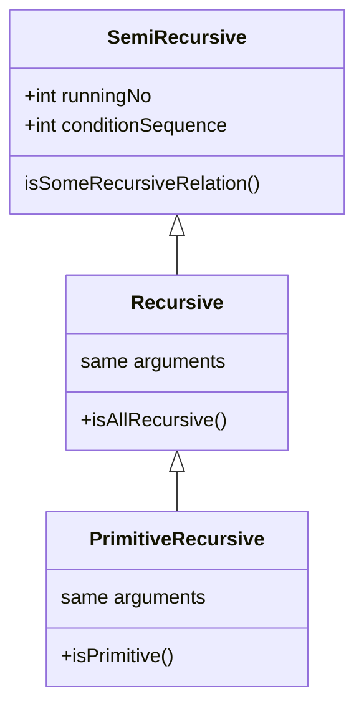

# Hierarchy of computability class
*2301601 Recursion theory*

```mermaid
classDiagram
    SemiRecursive <|-- Recursive
    Recursive <|-- PrimitiveRecursive

    SemiRecursive : +int runningNo
    SemiRecursive : +int conditionSequence
    SemiRecursive : isSomeRecursiveRelation()
    
    class Recursive {
        same arguments
        +isAllRecursive()
    }

    class PrimitiveRecursive {
        same arguments
        +isPrimitive()
    }
```